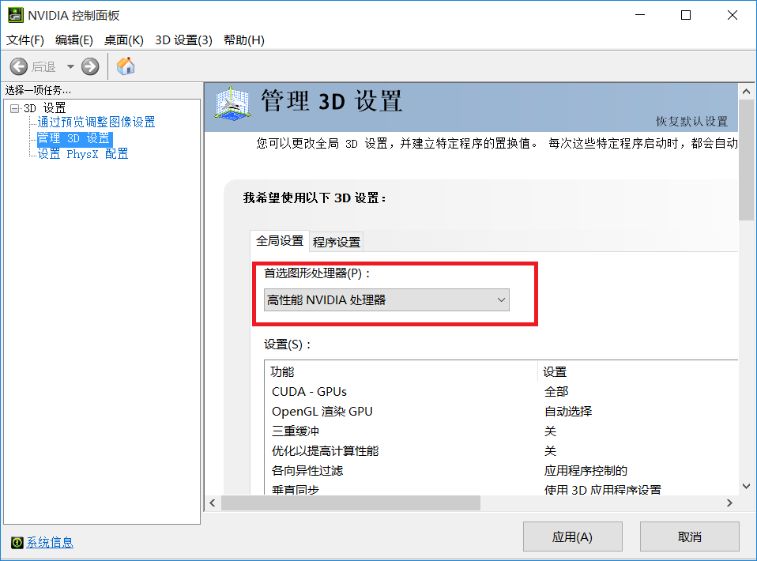

# final-project
CG final project

## 运行方式
- 克隆本项目到本地后，进入bin文件夹，运行CGFinal.exe  

## 注意事项
- 运行过程中，初始的摄像机模式是自由观察模式，按下“b”键可将摄像机模式切换成跟随人物的模式，按下“v”键则切换回去。  
- 如果运行时水面加载不出来，并在控制台上提示如下错误信息：
    ```
    | ERROR::SHADER: Compile-time error: Type: FRAGMENT
    ERROR: 0:1: '' :  illegal non-ASCII character (0xef)
    ERROR: 0:1: '' :  illegal non-ASCII character (0xbb)
    ERROR: 0:1: '' :  illegal non-ASCII character (0xbf)


    -- --------------------------------------------------- --
    | ERROR::Shader: Link-time error: Type: PROGRAM
    Attached fragment shader is not compiled.

    -- --------------------------------------------------- --
    ```
    这是由于显卡的问题，需要将首选图形处理器改为N卡：  
    打开N卡控制面板，首选图形处理器改为N卡  
      
    [参考博客](https://blog.csdn.net/z136411501/article/details/83306516)  