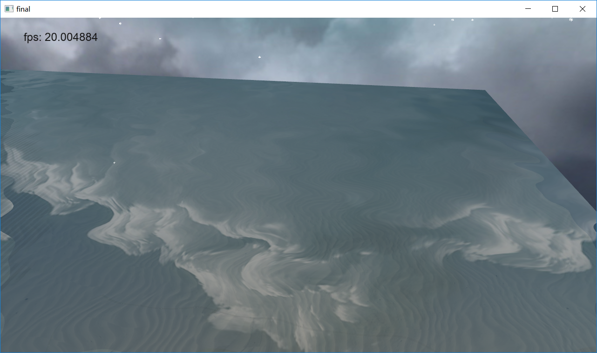

# 计算机图形学期末项目实验报告

||姓名|学号|
|---|---|---|
|组长|韩智慧|16340070|
|组员|何昶兴|16340071|

## 项目名称
第一人称视角场景漫游

## 项目概述
本项目为一个第一人称的场景展示，用户可以通过鼠标和键盘改变视角和位置。
该场景包括海水、小岛以及岛上的房子树木和人，并伴有下雪的粒子特效。

## 项目所涉及的知识点
+ Basic
    + Camera Roaming
    + Simple lighting and shading(phong) 
    + Texture mapping
    + Shadow mappingModel import & Mesh viewing
+ Bonus
    + Sky Box
    + Display Text 
    + Complex Lighting 
    + Particle System
    + Anti-Aliasing
    + Fluid Simulation

## 具体实现内容
+ 天空盒
    + 天空盒的具体实现原理就是用一个盒子将摄像机包裹，这样无论摄像机怎么移动，天空盒相对摄像机都是不懂的，这样就实现了摄像机在移动时天空盒无限远不动的效果。在加载天空盒时，我们最后加载天空盒并且我们需要关闭深度测试这样的话天空盒就会出现在整个场景的最下面，保证其他内容都能被看见，因此我们这样做的话天空盒就可以看到整个场景并且达到实现天空盒的目的。
    + 主要实现代码：
        + 实现起来就是一个立方体贴图，先设置一个立方体坐标：
        ```cpp
        float skyboxVertices[] = {
			-1.0f,  1.0f, -1.0f,
			-1.0f, -1.0f, -1.0f,
			1.0f, -1.0f, -1.0f,
			1.0f, -1.0f, -1.0f,
			1.0f,  1.0f, -1.0f,
			-1.0f,  1.0f, -1.0f,
            
                ...
                ...
		};
        ```
        + 之后加载图片，对这个立方体进行贴图：
        ```cpp
        std::vector<std::string> images;
	    images.push_back("res/images/SkyBox/right.jpg");
	    images.push_back("res/images/SkyBox/left.jpg");
	    images.push_back("res/images/SkyBox/up.jpg");
	    images.push_back("res/images/SkyBox/down.jpg");
	    images.push_back("res/images/SkyBox/front.jpg");
	    images.push_back("res/images/SkyBox/back.jpg");

	    int nW = 0, nH = 0, nrChannels = 0;
	    unsigned char* pChImg = nullptr;
	    for (int i = 0; i < images.size(); i++)
	    {
		    pChImg = stbi_load(images[i].c_str(), &nW, &nH, &nrChannels, 0);
		    glTexImage2D(GL_TEXTURE_CUBE_MAP_POSITIVE_X + i, 0, GL_RGB, nW, nH, 0, GL_RGB, GL_UNSIGNED_BYTE, pChImg);
		    stbi_image_free(pChImg);
	    }
        ```
    + 之后就是显示贴图等之前作业差不多的显示部分。
    + 运行截图：
    

+ 地形加载
    + 地形加载我使用的是用unity3D生成了一个地形图，然后到处高度图，就是一个灰度图，对整个地图生成三角网格，然后根据点的颜色对其的高度进行设置，颜色越接近白色，那么它的高度越高，颜色越接近黑色，其高度越低，计算出每点的高度后对其进行贴图，在某个高度范围内就是用某种贴图，以此来实现不同的地形效果，之后对地形进行加载，从而加载出满意的地形。
    + 主要代码：
    ```cpp
    Island(glm::vec3 pos, glm::vec3 size) : Position(pos), Size(size) {
		int nrChannels;
		unsigned char* image = stbi_load("res/images/island.jpg", &width, &height, &nrChannels, 0);
		m_vertexs.clear();
		m_normals.clear();
		m_textures.clear();
		for (int i = 0; i < height - 1; i++)
		{
			for (int k = 0; k < width - 1; k++)
			{
				glm::vec3 v1((k + 0), image[3 * ((i + 0) * width + (k + 0))], (i + 0));
				glm::vec3 v2((k + 0), image[3 * ((i + 1) * width + (k + 0))], (i + 1));
				glm::vec3 v3((k + 1), image[3 * ((i + 1) * width + (k + 1))], (i + 1));
				glm::vec3 v4((k + 1), image[3 * ((i + 0) * width + (k + 1))], (i + 0));
				m_vertexs.push_back(v1);
				m_vertexs.push_back(v2);
				m_vertexs.push_back(v3);
				m_vertexs.push_back(v1);
				m_vertexs.push_back(v3);
				m_vertexs.push_back(v4);

				glm::vec3 e1 = v2 - v1;
				glm::vec3 e2 = v3 - v1;
				glm::vec3 n1 = glm::normalize(glm::cross(e1, e2));
				m_normals.push_back(n1);
				m_normals.push_back(n1);
				m_normals.push_back(n1);
				glm::vec3 e3 = v3 - v1;
				glm::vec3 e4 = v4 - v1;
				glm::vec3 n2 = glm::normalize(glm::cross(e3, e4));
				m_normals.push_back(n2);
				m_normals.push_back(n2);
				m_normals.push_back(n2);
			}
		}

		for (int i = 0; i < m_vertexs.size(); i++)
		{
			glm::vec3 tmp(m_vertexs[i].x / width * 10.0f, m_vertexs[i].z / height * 10.0f, 0);
			m_textures.push_back(tmp);
		}
	}
    ``` 
    + 运行截图：
    

+ 文字显示
    + FreeType是一个能够用于加载字体并将他们渲染到位图以及提供多种字体相关的操作的软件开发库。它是一个非常受欢迎的跨平台字体库，它被用于Mac OS X、Java、PlayStation主机、Linux、Android等平台。FreeType的真正吸引力在于它能够加载TrueType字体。TrueType字体不是用像素或其他不可缩放的方式来定义的，它是通过数学公式（曲线的组合）来定义的。类似于矢量图像，这些光栅化后的字体图像可以根据需要的字体高度来生成。通过使用TrueType字体，你可以轻易渲染不同大小的字形而不造成任何质量损失。
    + 主要代码
        + 要加载一个字体，我们只需要初始化FreeType库，并且将这个字体加载为一个FreeType称之为面(Face)的东西。这里为我们加载一个从Windows/Fonts目录中拷贝来的TrueType字体文件arial.ttf。
        ```cpp
        FT_Library ft;
        if (FT_Init_FreeType(&ft))
            std::cout << "ERROR::FREETYPE: Could not init FreeType Library" << std::endl;

        FT_Face face;
        if (FT_New_Face(ft, "fonts/arial.ttf", 0, &face))
            std::cout << "ERROR::FREETYPE: Failed to load font" << std::endl;
        ```
        + 面加载完成之后，我们需要定义字体大小，这表示着我们要从字体面中生成多大的字形：
        ```cpp
        FT_Set_Pixel_Sizes(face, 0, 48);
        ```  
        此函数设置了字体面的宽度和高度，将宽度值设为0表示我们要从字体面通过给定的高度中动态计算出字形的宽度。

        + 一个FreeType面中包含了一个字形的集合。我们可以调用FT_Load_Char函数来将其中一个字形设置为激活字形。这里我们选择加载字符字形’X’：
        ```cpp
        if (FT_Load_Char(face, 'X', FT_LOAD_RENDER))
            std::cout << "ERROR::FREETYTPE: Failed to load Glyph" << std::endl;
        ```
        通过将FT_LOAD_RENDER设为加载标记之一，我们告诉FreeType去创建一个8位的灰度位图，我们可以通过face->glyph->bitmap来访问这个位图。

        使用FreeType加载的每个字形没有相同的大小（不像位图字体那样）。使用FreeType生成的位图的大小恰好能包含这个字符可见区域。例如生成用于表示’.’的位图的大小要比表示’X’的小得多。因此，FreeType同样也加载了一些度量值来指定每个字符的大小和位置。

        + 在需要渲染字符时，我们可以加载一个字符字形，获取它的度量值，并生成一个纹理，但每一帧都这样做会非常没有效率。我们应将这些生成的数据储存在程序的某一个地方，在需要渲染字符的时候再去调用。我们会定义一个非常方便的结构体，并将这些结构体存储在一个map中。
        ```cpp
        struct Character {
            GLuint     TextureID;  // 字形纹理的ID
            glm::ivec2 Size;       // 字形大小
            glm::ivec2 Bearing;    // 从基准线到字形左部/顶部的偏移值
            GLuint     Advance;    // 原点距下一个字形原点的距离
        };

        std::map<GLchar, Character> Characters;
        ```
        + 本次项目我们只生成ASCII字符集的前128个字符。对每一个字符，我们生成一个纹理并保存相关数据至Character结构体中，之后再添加至Characters这个映射表中。这样子，渲染一个字符所需的所有数据就都被储存下来备用了。
        ```cpp
        glPixelStorei(GL_UNPACK_ALIGNMENT, 1); //禁用字节对齐限制
        for (GLubyte c = 0; c < 128; c++)
        {
            // 加载字符的字形 
            if (FT_Load_Char(face, c, FT_LOAD_RENDER))
            {
                std::cout << "ERROR::FREETYTPE: Failed to load Glyph" << std::endl;
                continue;
            }
            // 生成纹理
            GLuint texture;
            glGenTextures(1, &texture);
            glBindTexture(GL_TEXTURE_2D, texture);
            glTexImage2D(
                GL_TEXTURE_2D,
                0,
                GL_RED,
                face->glyph->bitmap.width,
                face->glyph->bitmap.rows,
                0,
                GL_RED,
                GL_UNSIGNED_BYTE,
                face->glyph->bitmap.buffer
            );
            // 设置纹理选项
            glTexParameteri(GL_TEXTURE_2D, GL_TEXTURE_WRAP_S, GL_CLAMP_TO_EDGE);
            glTexParameteri(GL_TEXTURE_2D, GL_TEXTURE_WRAP_T, GL_CLAMP_TO_EDGE);
            glTexParameteri(GL_TEXTURE_2D, GL_TEXTURE_MIN_FILTER, GL_LINEAR);
            glTexParameteri(GL_TEXTURE_2D, GL_TEXTURE_MAG_FILTER, GL_LINEAR);
            // 储存字符供之后使用
            Character character = {
                texture, 
                glm::ivec2(face->glyph->bitmap.width, face->glyph->bitmap.rows),
                glm::ivec2(face->glyph->bitmap_left, face->glyph->bitmap_top),
                face->glyph->advance.x
            };
            Characters.insert(std::pair<GLchar, Character>(c, character));
        }
        ```
        + 在这个for循环中我们遍历了ASCII集中的全部128个字符，并获取它们对应的字符字形。对每一个字符，我们生成了一个纹理，设置了它的选项，并储存了它的度量值。有趣的是我们这里将纹理的internalFormat和format设置为GL_RED。通过字形生成的位图是一个8位灰度图，它的每一个颜色都由一个字节来表示。因此我们需要将位图缓冲的每一字节都作为纹理的颜色值。这是通过创建一个特殊的纹理实现的，这个纹理的每一字节都对应着纹理颜色的红色分量（颜色向量的第一个字节）。如果我们使用一个字节来表示纹理的颜色，我们需要注意OpenGL的一个限制：
        ```cpp
        glPixelStorei(GL_UNPACK_ALIGNMENT, 1);
        ```
        + OpenGL要求所有的纹理都是4字节对齐的，即纹理的大小永远是4字节的倍数。通常这并不会出现什么问题，因为大部分纹理的宽度都为4的倍数并/或每像素使用4个字节，但是现在我们每个像素只用了一个字节，它可以是任意的宽度。通过将纹理解压对齐参数设为1，这样才能确保不会有对齐问题（它可能会造成段错误）。

        + 当处理完字形后要清理FreeType的资源。
        ```cpp
        FT_Done_Face(face);
        FT_Done_FreeType(ft);
        ```
    + 运行截图：               
    

+ 粒子系统
    + 粒子系统的基本思想是：采用许多形状简单的微小粒子作为基本元素，用它们来表示不规则模糊物体。这些粒子都有各自的生命周期，在系统中都要经历“产生” 、 “运动和生长”及“消亡”三个阶段。粒子系统是一个有“生命”的系统，因此不象传统方法那样只能生成瞬时静态的景物画面，而是可以产生一系列运动进化的画面，这使得模拟动态的自然景物成为可能。

    + 利用粒子系统生成画面的基本步骤：  
        + 1、产生新的粒子；  
        + 2、赋予每一新粒子一定的属性；  
        + 3、删去那些已经超过生存期的粒子；  
        + 4、根据粒子的动态属性对粒子进行移动和变换；  
        + 5、显示由有生命的粒子组成的图像。   

    + 粒子系统采用随机过程来控制粒子的产生数量，确定新产生粒子的一些初始随机属性，如初始运动方向、初始大小、初始颜色、初始透明度、初始形状以及生存期等，并在粒子的运动和生长过程中随机地改变这些属性。粒子系统的随机性使模拟不规则模糊物体变得十分简便。  
    + 粒子系统应用的关键在于如何描述粒子的运动轨迹，也就是构造粒子的运动函数。函数选择的恰当与否，决定效果的逼真程度。其次，坐标系的选定（即视角）也有一定的关系，视角不同，看到的效果自然不一样了。
    
    + 粒子系统部分我主要是参考的博客，所以主要是用的别人的代码，自己主要是弄明白其原理并使用。

    + 运行截图：
    

+ 抗锯齿
    + 抗锯齿的原理其实很简单，就是通过多重采样，通过采多个点的方式来决定一个像素是否被填充颜色并根据采样数的多少来决定该像素的颜色的深浅。
    + 抗锯齿的实现在项目中的实现和使用就是通过开启抗锯齿，在代码中就是一行代码，使用起来没有什么难点，主要是理解一下运行的原理和多重采样的算法。

+ 流体模拟
    + 流体模拟主要参考的水面模拟的博客，之后为水面添加直线光照和阴影。实现过程主要也是参考别人的代码。
    + 运行截图：
    

## 小组分工及贡献

|姓名|完成内容|
|---|---|
|韩智慧|天空盒、地形加载、文字显示、粒子系统、抗锯齿、流体模拟等相关部分的代码完成以及实现报告相关内容的书写完成|
|何昶兴||

## 个人总结
+ 韩智慧：
    + 本学期的期末项目我主要完成了项目的天空盒、地形加载、文字显示、粒子系统、抗锯齿、流体模拟等内容，通过之前作业的学习和通过对他人博客的阅读和学习，完成了项目内容。通过一学期的学习和期末项目的完成，使我对计算机图形学相关的内容有了一些了解和认知，通过作业和项目对opengl的使用，让我对opengl有了更多的了解和使用经验。通过一学期的学习使我收获了很多。
